## Numerical Solution of a double pendulum with one member as spring using Lagrangian Mechanics


## Contents

- 1 List of variables
- 2 Introduction
- 3 System coordinate
- 4 Methodology
   - 4.1 Lagrange equation
   - 4.2 Numerical Solving
      - 4.2.1 Forward Euler Method
      - 4.2.2 Predictor-corrector method-Modified Euler Method
      - 4.2.3 Runge-Kutta Method
- 5 Initialisation and Implementation of Numerical Solving Algorithms on Python
   - 5.1 Declaration of variables as Function
   - 5.2 Formulation of Lagrange equation
   - 5.3 Defining System Parameters, Initial Conditions and Numeric solution parameters
   - 5.4 Numeric Solver Algorithm
      - 5.4.1 Forward Euler
      - 5.4.2 Predictor Corrector Method
      - 5.4.3 Runge-Kutta Method(RK-4)
   - 5.5 Plotting
- 6 Results
   - 6.1 Forward Euler Method
   - 6.2 Predictor-Corrector Method
   - 6.3 Runge-Kutta method
- 7 Discussion and conclusion


## List of Figures


1 Coordinate System\
2 Results of forward Euler method with h= 0.0001 (total energy(left),error(middle),and trajectory(right))\
3 Results of forward Euler method with h= 0.00001 (total energy(left),error(middle),and trajectory(right))\
4 Results of Predictor-Corrector with h= 0.01 (total energy(left),error(middle),and trajectory(right))\
5 Results of Predictor-Corrector with h= 0.001 (total energy(left),error(middle),and trajectory(right))\
6 Results of Predictor-Corrector with h= 0.0001 (total energy(left),error(middle),and trajectory(right))\
7 Results of Predictor-Corrector with h= 0.00001 (total energy(left),error(middle),and trajectory(right))\
8 Results of RK4 with h= 0.01 (total energy(left),error(middle),and trajectory(right))\
9 Results of RK4 with h= 0.001 (total energy(left),error(middle),and trajectory(right))\
10 Results of RK4 with h= 0.0001 (total energy(left),error(middle),and trajec-tory(right))\
11 Results of RK4 with h= 0.0001 (total energy(left),error(middle),and trajec-tory(right))\
12 Maximum absolute difference against the exact solution of different solver\


## 1 List of variables

- _L_ : Lagrangian of the system
- _t_ : Time
- _T_ : Kinetic energy
- _V_ : Potential energy
- _m_ 1 : Mass of bob 1 in the double pendulum
- _m_ 2 : Mass of bob 2 in the double pendulum
- _l_ 1 : Undeformed length of spring
- _r_ 1 : Deflection of spring
- _l_ 2 : length of pendulum 2
- _θ_ 1 : Angular displacement of Pendulum 1
- _θ_ 2 : Angular displacement of Pendulum 2
- _x_ 1 : x coordinate of Pendulum 1
- _x_ 2 : x coordinate of Pendulum 2
- _y_ 1 : y coordinate of Pendulum 1
- _y_ 2 : y coordinate of Pendulum 2
- _vl_ 1 : Linear velocity of Pendulum 1
- _vl_ 2 : Linear velocity of Pendulum 2
- _x_ ̇ 1 : x component of Linear velocity of Pendulum 1
- _y_ ̇ 1 : y component of Linear velocity of Pendulum 1
- _x_ ̇ 2 : x component of Linear velocity of Pendulum 2
- _y_ ̇ 2 : y component of Linear velocity of Pendulum 2
- _g_ : Acceleration due to gravity
- _k_ : Spring constant
- _LE_ : Lagrange equations
- _θ_ ̇ 1 : Angular velocity of pendulum 1
- _θ_ ̇ 2 : Angular velocity of pendulum 2
- _r_ ̇ 1 : Linear velocity of spring through its axis
- _θ_ ̈ 1 : Angular acceleration of pendulum 1
- _θ_ ̈ 2 : Angular acceleration of pendulum 2
- _r_ ̈ 1 : Linear acceleration of spring through its axis
- _ω_ 1 : Angular velocity of Pendulum 1
- _ω_ 2 : Angular velocity of Pendulum 2
- _v_ 1 : Liner velocity of spring through its axis
- _yi_ +1: Solution of next step
- _yi_ : Solution of current step
- _h_ : Step size
- _yPi_ +1: Predicted solution of next step
- _yCi_ +1: Corrected solution of next step
- _k_ 1 _,k_ 2 _,k_ 3 _,k_ 4 : Four estimates of Runge Kutta Method


## 2 Introduction

A double pendulum is a mechanical system consisting of two pendulums connected together.
It’s more complex than a single pendulum as the motion of two pendulums depends on each
other, making it a classic example of a complex numerical system often used as a benchmark
for testing computational algorithms. In this project, we also make the 1st pendulum a spring
attached to a mass m, which increases the degree of freedom of the system by 1 and makes it
more interesting.
The numerical solution of the system is done using Lagrange equations (sometimes they
are called the Euler-Lagrange equations). Lagrangian mechanics is a formalism used to de-
scribe the dynamics of mechanical systems in terms of generalized coordinates and their time
derivatives. The Lagrangian is a scalar function that encodes the kinetic and potential energy
of the system.
Being an initial value problem (IVP), the ordinary differential equations(ODE) are solved
by numerical methods in three solver algorithms, the forward Euler method (explicit method),
the predictor-corrector method and Runge-Kutta Method. Each method has a different level
of accuracy and computational efficiency. Thus it is necessary to experiment with different
methods to find the most appropriate one.
The code is written in Python. Python is the most popular language for numerical methods
as it has an extensive scientific library and free-open software. Python librariesNumPy,
SymPy,andMatplotlibare used for the simulation.

## 3 System coordinate

As illustrated in the figure 1, the first member of the double pendulum is a spring with
original length _l_ 1 with a deflection _r_ 1 , which makes a total length of _l_ 1 + _r_ 1 and _l_ 2 is the length
of the second member. _m_ 1 and _m_ 2 are the masses attached to pendulum 1 and pendulum 2
respectively, which makes an angle _θ_ 1 and _θ_ 2 with the x-axis.
The degree of freedom of the system as 3 that is, _θ_ 1 , _r_ 1 and _θ_ 2

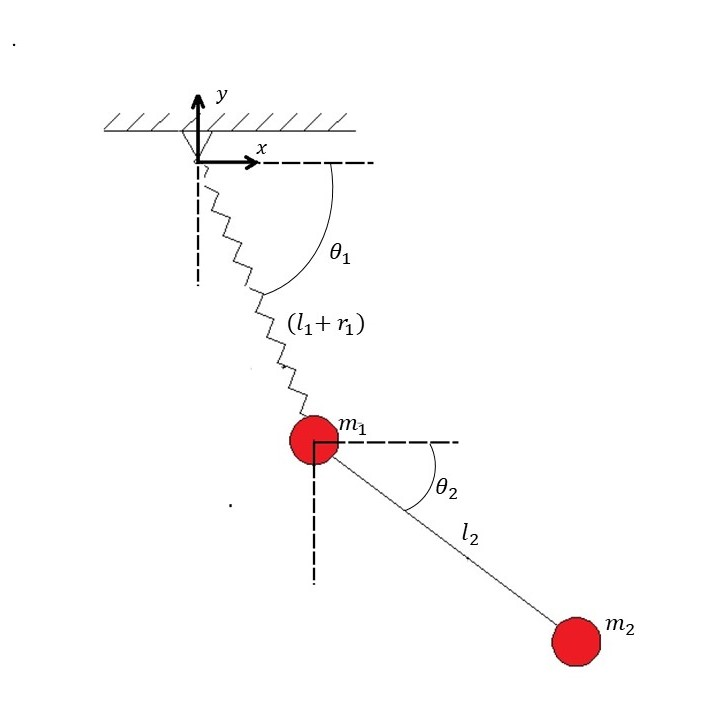
Figure 1: Coordinate System


## 4 Methodology

The motion of a double pendulum can be quite complex and exhibits chaotic behavior. The
double pendulum system is quite sensitive to its initial conditions, a small change in the initial
condition will give rise to a different result.
The motion of the double pendulum is simulated by formulating an ordinary differential
equation(ODE) using the Lagrange equation or Euler-Lagrange equation. Then these ODE
are solved using numerical methods such as Forward Euler, Corrector-predictor, and Runge-
Kutta(RK4) method.

### 4.1 Lagrange equation

Lagrangian mechanics [3] is based on the principle of least action integral of the system, which
is related to the difference between the kinetic and potential energies of the system. The
generalized Lagrange equation :
$$
\begin{align}
   \tag{1}
   \frac{∂L}{∂qi}-\frac{d}{dt}(\frac{∂L}{∂\dot{q}i})=0
\end{align}
$$

where L is the Lagrangian of the system can be written as the difference between the
kinetic energy T and potential energy V[1]:
$$
\begin{align}
\tag{2}
L=T-V
\end{align}
$$

Let x-y be the coordinate system with the origin coinciding with the suspension point of
Pendulum 1(with the spring), and then the coordinates of the pendulum are defined by :
$$
\begin{align}
\tag{3}
x_1 = (l_1+r_1)cos(θ_1) ; y_1 = -(l_1+r_1)sin(θ_1)
\end{align}
$$

$$
\begin{align}
\tag{4}
x_2 = x_1+l_2cos(θ_2) ; y_2 = -y_1-l_2sin(θ_2)
\end{align}
$$

The kinetic energy of the system :

$$
\begin{align}
\tag{5}
L=\frac{1}{2}m_1(\dot{x_1}^2+\dot{y_1}^2)+\frac{1}{2}m_2(\dot{x_2}^2+\dot{y_2}^2)
\end{align}
$$

The potential energy of the system :
$$
\begin{align}
\tag{6}
V = m_1gy_1+m_2gy_2 * \frac{1}{2}kr_1^2
\end{align}
$$


Thus the Lagrangian of the system :
$$
\begin{align}
\tag{7}
L=\frac{1}{2}m_1(\dot{x_1}^2+\dot{y_1}^2)+\frac{1}{2}m_2(\dot{x_2}^2+\dot{y_2}^2)-m_1gy_1-m_2gy_2-\frac{1}{2}kr_1^2
\end{align}
$$


In our system, there are three variables due to three degrees of freedom. Hence, there
will be three Lagrange equations with respect to _θ_ 1 , _r_ 1 , and _θ_ 2 which are _LE_ 1 , _LE_ 2 , and _LE_ 3
respectively. It is to be noted that the number of Lagrange equations of a system is always
equal to the number of degrees of freedom.

$$
\begin{align}
\tag{8}
LE_1 = \frac{∂L}{∂θ_1}-\frac{d}{dt}(\frac{∂L}{∂\dot{θ}_1})=0
\end{align}
$$
$$
\begin{align}
\tag{9}
LE_2 = \frac{∂L}{∂r_1}-\frac{d}{dt}(\frac{∂L}{∂\dot{r}_1})=0
\end{align}
$$
$$
\begin{align}
\tag{10}
LE_3 = \frac{∂L}{∂θ_2}-\frac{d}{dt}(\frac{∂L}{∂\dot{θ}_2})=0
\end{align}
$$

simplifying the above three equations, we will get second-order differential equations and
convert them to explicit form for _θ_ ̈ 1 , _r_ ̈ 1 and _θ_ ̈ 2. Note that these equations are highly complicated
and simplified using theSymPymodule of python.

### 4.2 Numerical Solving

Numerical algorithms are used to approximate the solution of ordinary differential equations.
The IVP algorithms used in this project are the forward Euler method (explicit method), the
predictor-corrector method, and Runge-Kutta Method. The accuracy of the solution of any
algorithm is proportional to the step size.
The Local Truncation Error is the difference observed between the analytical and the
numerical solution after one step. In general, this error is proportional to _hp_ +1, where p is
the order of the method. The global error is the result of accumulating, local error along the
simulation[2].
The differential equation formulated using the Lagrange equation in Section 4.1 is second-
order ODE. As Runge-Kutta can only solve first-order ODE and reduce the solving steps in
other algorithms, each equation is transformed into first-order equations.

$$
\begin{align}
\tag{11}
\ddot{θ}_1 → \frac{dω_1}{dt}= \ddot{θ}_1 ; \frac{dθ_1}{dt}=ω_1
\end{align}
$$

$$
\begin{align}
\tag{12}
\ddot{r}_1 → \frac{dv_1}{dt}= \ddot{r}_1 ; \frac{dr_1}{dt}=v_1
\end{align}
$$

$$
\begin{align}
\tag{13}
\ddot{θ}_2 → \frac{dω_2}{dt}= \ddot{θ}_2 ; \frac{dθ_2}{dt}=ω_2
\end{align}
$$

#### 4.2.1 Forward Euler Method

The Forward Euler or explicit method is the simplest method to solve an IVP. It uses the slope
or derivative of the solution to find the approximate solution of the next step. The general
formula for the explicit method is :

$$
\begin{align}
\tag{14}
yi +1= yi + hf ( xi,yi ), where f( xi,yi )= \frac{dy_i}{dx_i}
\end{align}
$$


The forward Euler is a first-order method, so the Local Truncation Error of Euler’s method
is _O_ ( _h_^2 ), which means that the error in the approximation at each time step is proportional
to _h_^2 .Predictor-corrector methods are a class of numerical methods for solving ordinary differ-
ential equations (ODEs) that use a two-step process to improve the accuracy of the approxi-
mation.


#### 4.2.2 Predictor-corrector method-Modified Euler Method

Predictor-corrector methods use a two-step process to improve the accuracy of the approxi-
mation. Here we are using the modified Euler method (also known as Heun’s method) uses
the forward Euler as a predictor and the backward Euler method as a corrector. The forward
Euler will give a predicted value that is used as input for the backward to calculate the cor-
rected value. The approximated value is then calculated as the average of the corrected and
predicted values. The generalized equation of modified Euler is :
$$
\begin{align}
\tag{15}
Predictor : y^P_i +_1 = y_i +hf(x_i,y_i)
\end{align}
$$

$$
\begin{align}
\tag{16}
Corrector : y^C_i +_1 = y_i +hf(x_i+_1,y^P_i+_1)
\end{align}
$$

$$
\begin{align}
\tag{17}
Approximated : y_i +_1 = \frac{1}{2}(y^P_i+_1 + y^C_i +_1)
\end{align}
$$


where $h$ is the step-size, $f(x_i,y_i)= \frac{dy_i}{dx_i}$ and $ x_i+ _1= x_i + 1$
The modified Euler is a second-order predictor-corrector method, thus the Local Truncation
Error of Euler’s method is $O(h^3)$

#### 4.2.3 Runge-Kutta Method

The Runge-Kutta method or RK4 the fourth-order Runge-Kutta method is a numerical
method that is used to solve ordinary differential equations. This method works by approx-
imating the solution to an initial value problem by using a weighted average of estimates of
derivatives of four points within the interval of integration. The four estimates are :

$$
\begin{align}
\tag{18} 
k_1 = f(x_i,y_i), where f(x_i,y_i)= \frac{dy_i}{dx_i}
\end{align}
$$

$$
\begin{align}
\tag{19} 
k_2 = f(x_i+\frac{h}{2},y_i+\frac{k_1}{2})
\end{align}
$$

$$
\begin{align}
\tag{20} 
k_3 = f(x_i+\frac{h}{2},y_i+\frac{k_2}{2})
\end{align}
$$

$$
\begin{align}
\tag{21} 
k_4 = f(x_i+h,y_i+k_3)
\end{align}
$$

$$
\begin{align}
\tag{22} 
y_i+_1 = y_i +\frac{h}{6}(k_1+2k_2+2l_3+k_4)
\end{align}
$$

where $h$ is the step size.
The Runge-Kutta method(RK4) is highly accurate. It is a fourth-order method and the
Local Truncation Error is $O(h^5)$, which means that it has an error term that is proportional
to $h^5$ , where $h$ is the step size.


## 5 Initialisation and Implementation of Numerical Solving Algorithms on Python

The programming codes to implement the methodology discussed in the previous section are implemented through Python language. The major Python library modules used in this simulation areNumPy, SymPy,andMatplotlib.NumPyis a library that provides support for large, multi-dimensional arrays and matrices.SymPyis a library for symbolic mathematics, and it allows us to perform symbolic calculations in Python. Matplotlibis a library for creating visualizations in Python. Complete source code is shown in Appendix 8

### 5.1 Declaration of variables as Function

To develop the Lagrange equation in equation 8,9 and 10, we need to declare all the variables as  functions.sympymodule is used. The python source code for the declaration of the following:

```
#define variables constant variables
t,m1,l1,m2,l2,g,k = smp.symbols('t m_1 l_1 m_2 l_2 g k')
```

```
#define changing variables (degree of freedom)
theta1,theta2,r1 = smp.symbols('theta_1, theta_2, r_1', cls = smp.Function)
#make them function of time
theta1 = theta1(t)
r1= r1(t)
theta2= theta2(t)
#define first derivative
theta1_d = smp.diff(theta1,t)
r1_d = smp.diff(r1,t)
theta2_d = smp.diff(theta2,t)
```

``` 
#define second derivative
theta1_dd = smp.diff(theta1_d,t)
r1_dd = smp.diff(r1_d,t)
theta2_dd = smp.diff(theta2_d,t)
```

```
#define coordniate variables
x1,y1,x2,y2= smp.symbols('x_1,y_1,x_2,y_2', cls = smp.Function)
```
```
#make them function of respective variables
x1 = x1(theta1)
y1 = y1(theta1)
x2 = x2(theta1,r1,theta2)
y2 = y2(theta1,r1,theta2)
```
```
#define coordinates of the mass
x1= (l1+r1)*smp.cos(theta1)
y1= -(l1+r1)*smp.sin(theta1)
x2= x1 + l2*smp.cos(theta2)
y2= y1 - l2*smp.sin(theta2)
```

### 5.2 Formulation of Lagrange equation

For the formulation of the Lagrange equation (equation 8,9 and 10)sympymodule is used.
The python source code for the formulation of the Lagrange equation is as follows :

```
#define the equation of the Potential, Keinetic Energy and Lagrangian
T= 1/2 *m1* (smp.diff(x1,t)**2 + smp.diff(y1,t)**2)+\
1/2 *m2* (smp.diff(x2,t)**2 + smp.diff(y2,t)**2)
V = (m1*g*y1) + (m2*g*y2) + 1/2 * k * r1** 2
L= T-V
```

```
#calculate Lagrangian’s equation and solve for equation
#of motion of the system
LE1 = smp.diff(L, theta1) - smp.diff(smp.diff(L, theta1_d), t)
LE1 = LE1.simplify()

LE2 = smp.diff(L, r1) - smp.diff(smp.diff(L, r1_d), t)
LE2 = LE2.simplify()

LE3 = smp.diff(L, theta2) - smp.diff(smp.diff(L, theta2_d), t)
LE3 = LE3.simplify()

sols = smp.solve([LE1,LE2,LE3],(theta1_dd,r1_dd,theta2_dd),\
simplify=True, rational = True)
```

As Runge-Kutta method can only solve first-order ODE and to reduce the solving steps in other methods the equations are transformed into first-order as shown in equation 11,12 and 13. The python code for the same is as follows :

```
#reduction of 2nd order to 1st order ODE
dw1dt_f = smp.lambdify((k,g,m1,l1,m2,l2,theta1,theta1_d,r1,r1_d,theta2,theta2_d),\
sols[theta1_dd],modules=[’numpy’])
dtheta1dt_f = smp.lambdify(theta1_d,theta1_d,modules=[’numpy’])

dv1dt_f = smp.lambdify((k,g,m1,l1,m2,l2,theta1,theta1_d,r1,r1_d,theta2,theta2_d),\
sols[r1_dd],modules=[’numpy’])
dr1dt_f = smp.lambdify(r1_d,r1_d,modules=[’numpy’])

dw2dt_f = smp.lambdify((k,g,m1,l1,m2,l2,theta1,theta1_d,r1,r1_d,theta2,theta2_d),\
sols[theta2_dd],modules=[’numpy’])
dtheta2dt_f = smp.lambdify(theta2_d,theta2_d,modules=[’numpy’])
```

```
#create a function to calculate the total energy
E = T+V
E = E.simplify()
Energy= smp.lambdify((k,g,m1,l1,m2,l2,theta1,theta1_d,r1,r1_d,theta2,theta2_d)\
,E,modules=[’numpy’])
```

```
#assemble all of the equations in one function

def system(variables, t):
theta1,w1,r1,v1,theta2,w2 = variables
return [
dtheta1dt_f(w1),
dw1dt_f(k,g,m1,l1,m2,l2,theta1,w1,r1,v1,theta2,w2),
dr1dt_f(v1),
dv1dt_f(k,g,m1,l1,m2,l2,theta1,w1,r1,v1,theta2,w2),
dtheta2dt_f(w2),
dw2dt_f(k,g,m1,l1,m2,l2,theta1,w1,r1,v1,theta2,w2)
]
```
Note that the total energy is calculated to plot the total energy graph.

### 5.3 Defining System Parameters, Initial Conditions and Numeric solution parameters

The assumed System parameters and initial conditions are as follows :

```
# define the System parameters
g=9.
k=
m1=
m2=
l1=
l2=
# define Initial Conditions
theta1_0 = 5*np.pi/
theta1_d_0 = 0
r1_0 = 0
r1_d_0 = 0
theta2_0 = 5*np.pi/
theta2_d_0 = 0
```

The Numerical Solution parameters include step sizehwhich will be changed in multiple
simulations. The source code for the same is :

```
#Numeric Solution parameters
h= 0.001 # step size
simulation_time = 10 # simulation time in seconds
grids = int(simulation_time/h)
grid_points = np.linspace(0,simulation_time,grids)

y0 = np.array([theta1_0,theta1_d_0,r1_0,r1_d_0,theta2_0,theta2_d_0])
ans = np.zeros((len(grid_points),6)) #
ans[0]=y
t=0
```
### 5.4 Numeric Solver Algorithm

Three algorithms are used in this simulation project: Forward Euler, Predictor-Corrector, and
Runge-Kutta method (RK4).Numpymodule is used. In the original source code, only one
method will be active, other methods will be put onCommentinside theforloop.

#### 5.4.1 Forward Euler

The source code of the forward Euler according to the equation 14 as follows

```
# Numeric Solvers
for i in range(1,len(grid_points)):

# Forward Euler method
   y0=list(np.array(y0))+(np.array(system(ans[i-1],t))*h)

   ans[i]= y
   t=t+h
```
#### 5.4.2 Predictor Corrector Method

The modified Euler method is the predictor-corrector method used in this project. The python
code for the same are follows(equation 15,16 and 17)

```
## Numeric Solvers
for i in range(1,len(grid_points)):
# Predictor Corrector Method
   predict=list(np.array(y0))+(np.array(system(ans[i-1],t))*h)
   correct = list(np.array(y0))+(np.array(system(predict,t))*h)
   y0= (predict+correct)/
   ans[i]= y
   t=t+h
```

#### 5.4.3 Runge-Kutta Method(RK-4)

The fourth order Runge-Kutta method is the most accurate algorithm used in this project.
The source code to implement this algorithm with respect to equation 18,19,20,21 and 22 is
as follows :

```
## Numeric Solvers
for i in range(1,len(grid_points)):

# Runge-Kutta method
   k1 = system(y0,t)
   k2=system(list(np.array(y0)+(np.array(k1)*h/2)),t+h/2)
   k3=system(list(np.array(y0)+(np.array(k2)*h/2)),t+h/2)
   k4=system(list(np.array(y0)+(np.array(k3)*h)),t+h)
   y0=list(np.array(y0)+((np.array(k1)+np.array(k2)*2+np.array(k3)*2+np.array(k4)))*h/6)
   ans[i]= y
   t=t+h
```
### 5.5 Plotting

The Plotting is done withmatplotlibmodule of python. Trajectories of mass _m_ 1 and _m_ 2
are plotted asFigure 1 and animated, which saves into a .gif file. The total energy and
total energy difference from one step to another are also plotted asfigure 2andfigure
3 respectively. Following are the source codes :

```
# plotting
def get_coord(l1,l2,theta1 , r1, theta2):
   return ((l1+r1)*np.cos(theta1),
   -(l1+r1)*np.sin(theta1),
   (l1+r1)*np.cos(theta1)+l2*np.cos(theta2),
   -(l1+r1)*np.sin(theta1)-l2*np.sin(theta2)),


x1, y1, x2, y2 = get_coord(l1,l2,ans.T[0], ans.T[2], ans.T[4])

trajectory_x1=[]
trajectory_y1=[]
trajectory_x2=[]
trajectory_y2=[]

def animate(i):
   i= i * int(grids/(simulation_time*50))
   ln1.set_data([0, x1[i]], [0, y1[i]])
   ln2.set_data([x1[i], x2[i]], [y1[i], y2[i]])
   trajectory_x1.append(x1[i])
   trajectory_y1.append(y1[i])
   trajectory_x2.append(x2[i])
   trajectory_y2.append(y2[i])
   trajectory1.set_data(trajectory_x1,trajectory_y1)
   trajectory2.set_data(trajectory_x2,trajectory_y2)
   return ln1,ln2,trajectory1,trajectory

fig, ax = plt.subplots(1,1, figsize=(8,8))
ax.grid()
ln1, = plt.plot([], [], ’ro--’, lw=3, markersize=1)
ln2, = plt.plot([], [], ’ro-’, lw=3, markersize=8)
trajectory1, = ax.plot([], [],’-’,color=’green’,alpha=0.5)
trajectory2, = ax.plot([], [],’-’,color=’blue’,alpha=0.5)
ax.set_ylim(-8, 8)
ax.set_xlim(-8,8)
ani = animation.FuncAnimation(fig, animate, frames=int(simulation_time*50), interval =50 )

ani.save(’spring_pendulum.gif’,writer=’pillow’,fps=50)
fig.savefig(’final_frame.png’)

Eng=[]
for i in range(0,len(grid_points)):
Eng.append(Energy(k,g,m1,l1,m2,l2,ans.T[0,i],ans.T[1,i],ans.T[2,i],ans.T[3,i],ans.T[4,i],ans.T[5,i]))

figure2 = plt.figure(2)
figure2 =plt.plot(grid_points,Eng)
figure2=plt.show()

delta_TE=np.zeros((grids, 1))
for i in range(0,len(Eng)-1) :
delta_TE[i,:]=np.array(Eng[0]-Eng[i])

figure3 = plt.figure(3)
figure3 = plt.plot(grid_points,delta_TE)
figure3 = plt.show()

print(’maximum error =’)
print(float(max(abs(delta_TE))))
```


## 6 Results

Multiple simulations have been run with the same system parameters and initial conditions.
In each simulation, different step size _h_ is used (section 5.3) and solved with three algo-
rithms(section 5.4) with each _h_ value. The value of _h_ that has been taken is 0.1, 0.001, 0.0001,
and 0.00001. Trajectories are plotted for all the simulations which will give an idea about the
influences of _h_. The value of _h_ influences proportionally to the error of the system. To show
how the error changes with the value of _h_ , the principle of conservation of energy has been
taken into account and Total Energy vs Time and change in Energy vs time graph is plotted.

### 6.1 Forward Euler Method

In forward Euler, simulation with step size $h = 0.01 and 0.001 didn’t converge and the simulation failed in between. Thus only _h_ = 0_._ 0001 and 0_._ 00001 has an output. The trajectories
for the same are shown below\
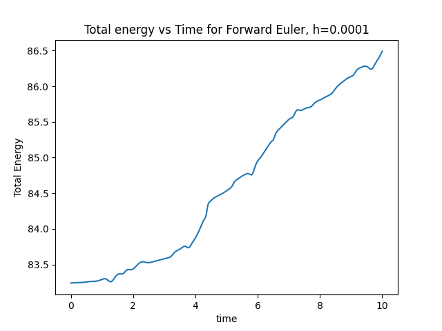 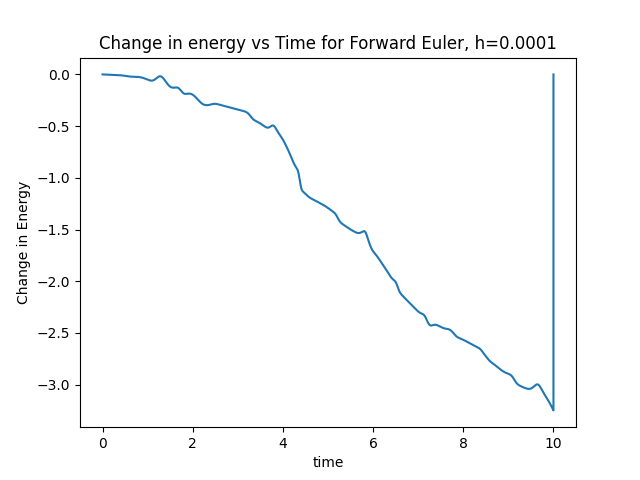 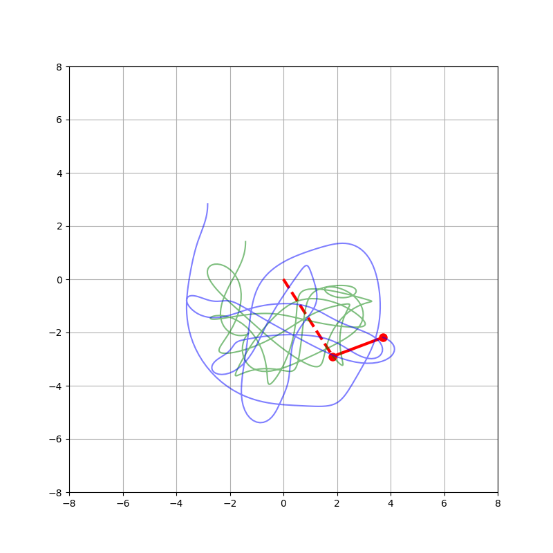

Figure 2: Results of forward Euler method with h= 0.0001 (total energy(left),error(middle),and trajectory(right))\
 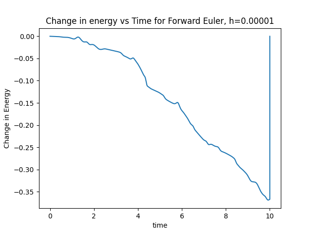 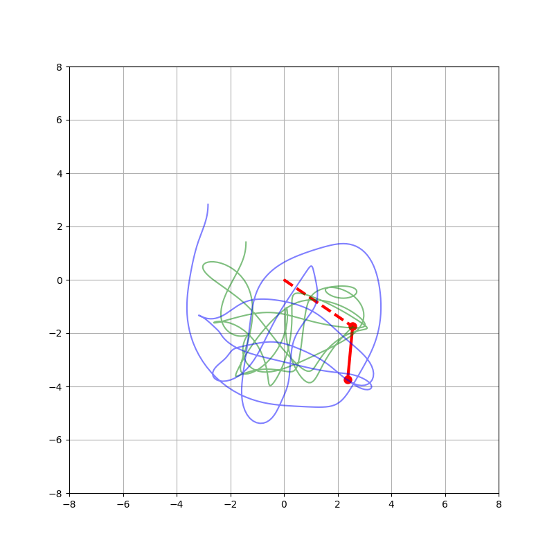

Figure 3: Results of forward Euler method with h= 0.00001 (total en-
ergy(left),error(middle),and trajectory(right))


The figure above illustrates all of the results that were achieved during the simulation with
the forward Euler method. Since in all of the simulations same system parameters and the
initial conditions are used, differences in the results are only due to the change in step size.
We can see in Figures 2 and 3, that the errors are higher even with the very small step size.
Furthermore, trajectories are not similar. Therefore, a more advanced solver is required to
solve the system efficiently.

### 6.2 Predictor-Corrector Method

The Predictor-Corrector Method with _O_ ( _h_^3 )is also an explicit method. Moreover, it is ex-
pected to converge with the smaller step size. Therefore, the system is simulated with step
size h = 0.01, 0.001, 0.0001, and 0.00001 and are illustrated below.\
 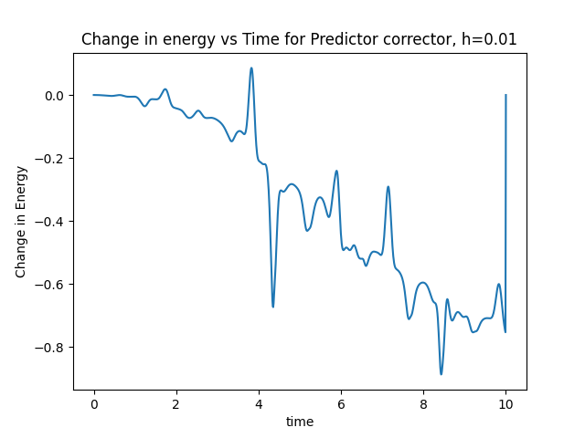 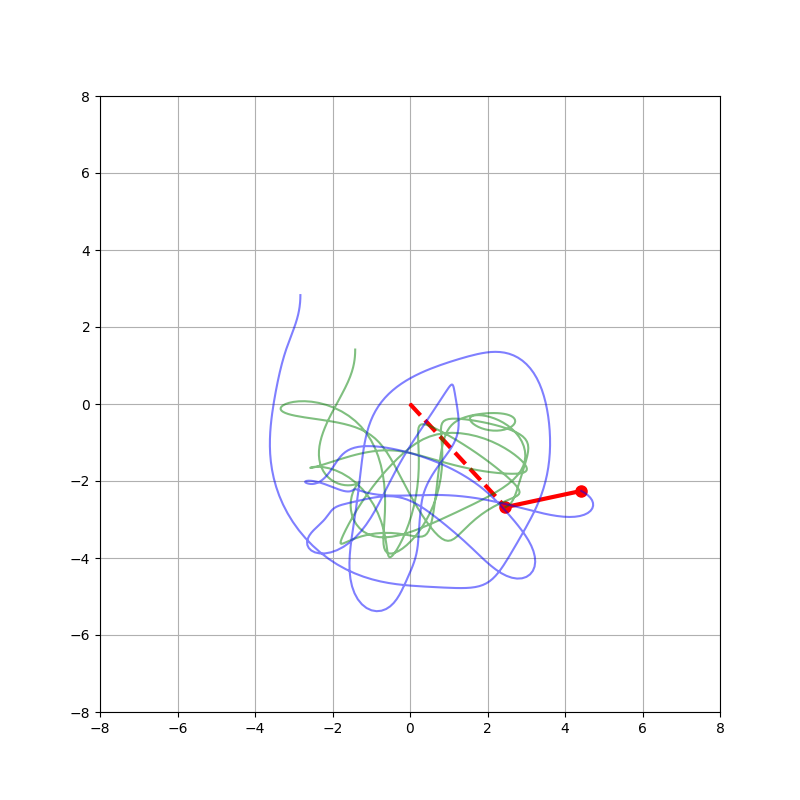 

Figure 4: Results of Predictor-Corrector with h= 0.01 (total energy(left),error(middle),and
trajectory(right))\
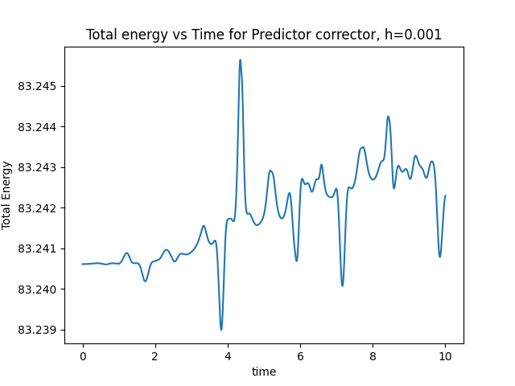 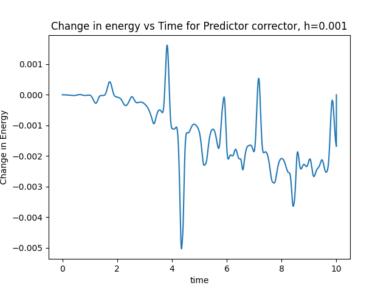  

Figure 5: Results of Predictor-Corrector with h= 0.001 (total energy(left),error(middle),and trajectory(right))\
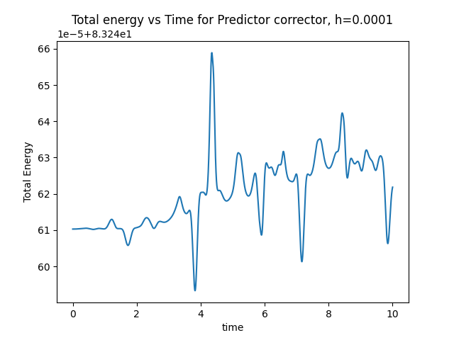 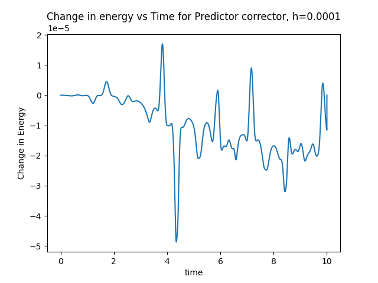 

Figure 6: Results of Predictor-Corrector with h= 0.0001 (total energy(left),error(middle),and
trajectory(right))\
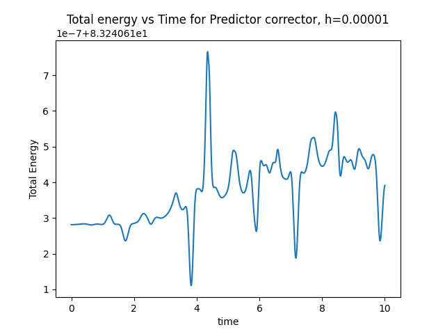 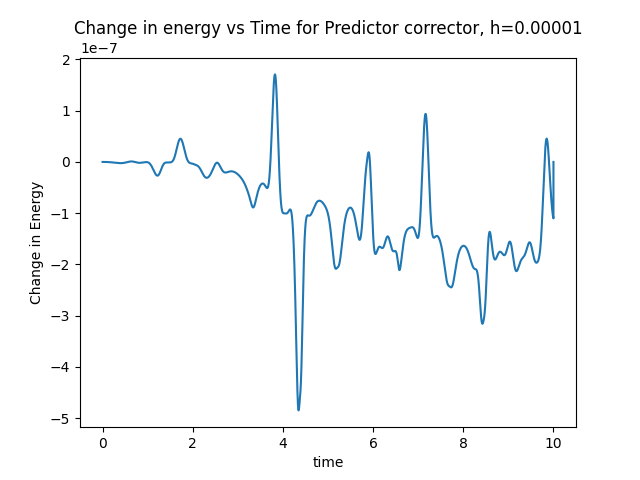  

Figure 7: Results of Predictor-Corrector with h= 0.00001 (total energy(left),error(middle),and
trajectory(right))

The above figure describes the simulation result with the Predictor-Corrector Method. In
Figure4,5,6 and 7, it is clear that the trajectory for $h=0.001,0.001 and 0.00001$ are same.
As expected the error is decreasing as step size $h$ reduces. The error is reducing from a scale
of $10^-1$ in Figure4 to a scale of $10^-7$ in Figure 7. The computational time for $h= 0.00001$ is
much higher than that of the lower step size.

### 6.3 Runge-Kutta method

The previous numerical solver was able to solve the system with an error of less than 106. However, the classical Runge-kutta method is a relatively faster and more advanced numerical solving method with the local error of $O( h^5 )$. Therefore, we simulated the system with a similar step size, and the results are shown below.\
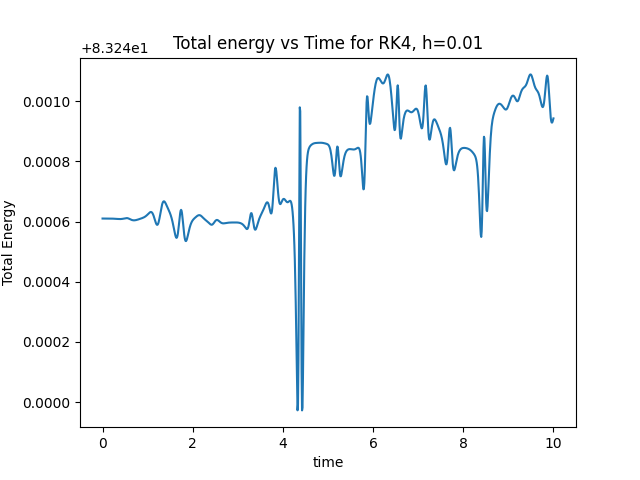
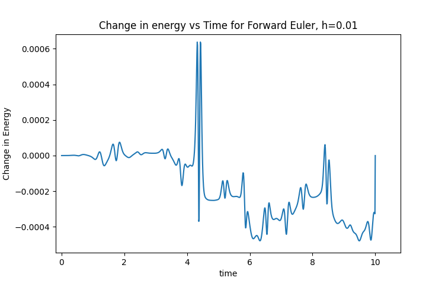
 

Figure 8: Results of RK4 with h= 0.01 (total energy(left),error(middle),and trajectory(right))\
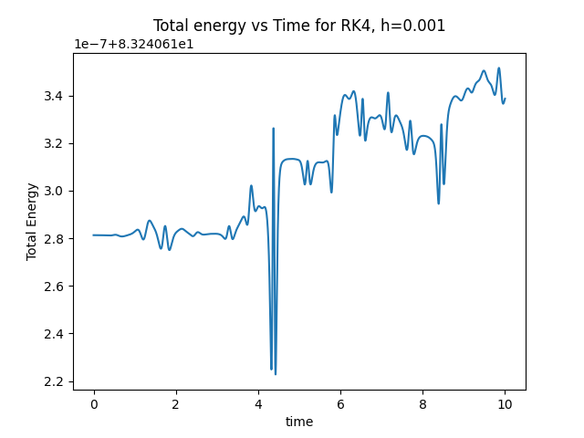 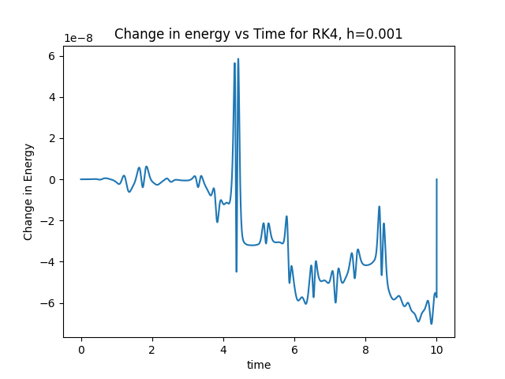 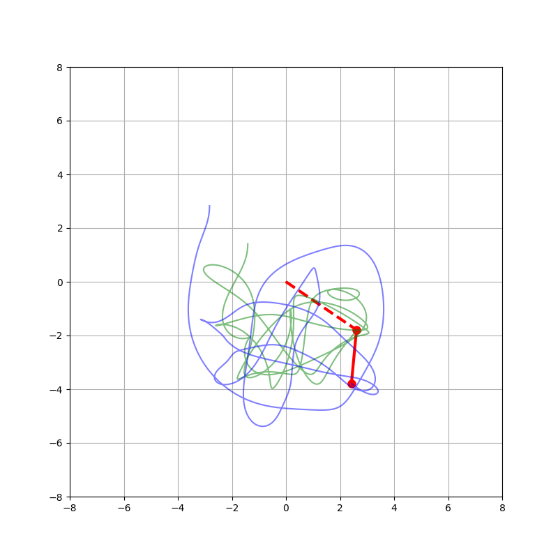 

Figure 9: Results of RK4 with h= 0.001 (total energy(left),error(middle),and trajectory(right))\
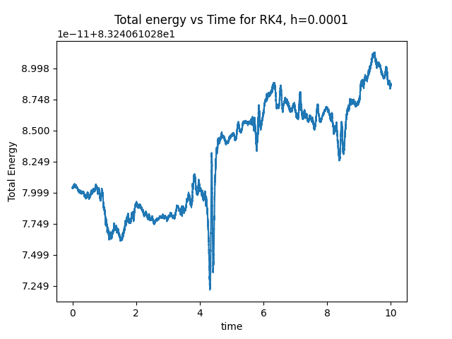 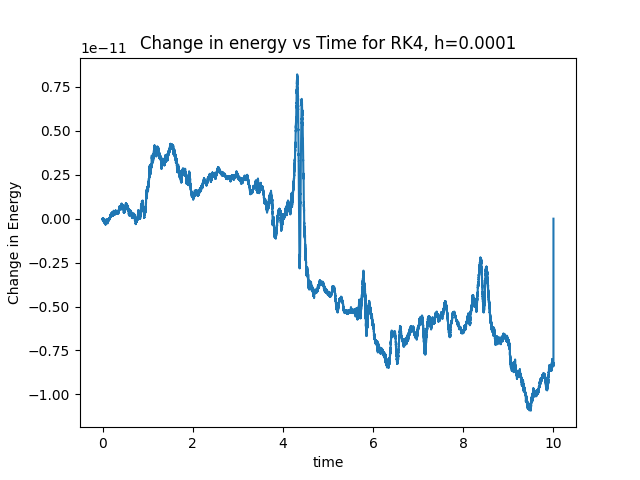  

Figure 10: Results of RK4 with h= 0.0001 (total energy(left),error(middle),and trajec-
tory(right))\
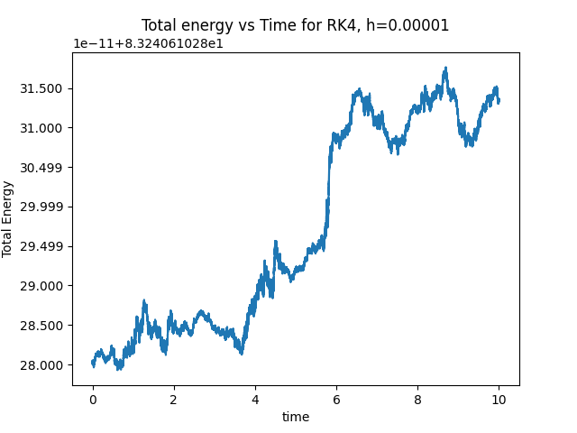 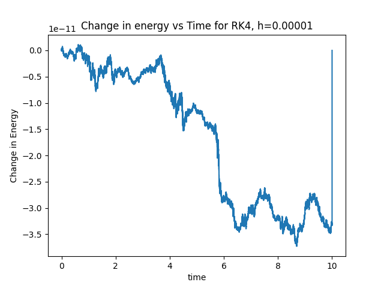 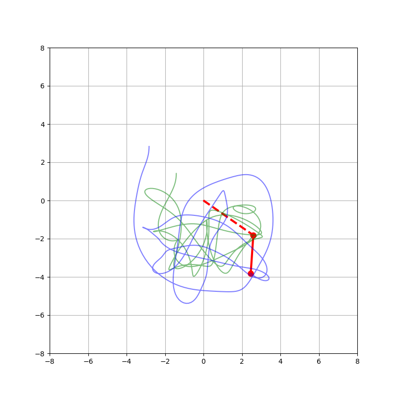 

Figure 11: Results of RK4 with h= 0.0001 (total energy(left),error(middle),and trajec-
tory(right))

In the above figures, 8, 9,10 and 11, it is interesting to note that the trajectories are exactly
identical in all values of _h_. The error variation between each step size has been illustrated in
other figures. The interpretation of the error changes from a scale of 10 −^4 to 10 −^11. Figure 10
and 11 have a minute error difference, both are in the scale of 10 −^11


## 7 Discussion and conclusion

It is evident from the result that as the order of the algorithm increases the difference in
trajectory decreases, and thus error also decreases To show the error difference between each
method, the max error from each method for each h value has been taken and a graph is
plotted with max error vs h for all three algorithms.

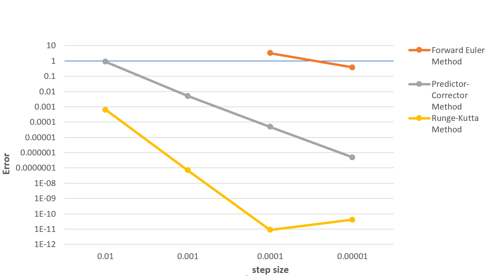
Figure 12: Maximum absolute difference against the exact solution of different solver

As we can see in the above graph Rung-Kutta method which is an order 4 algorithm
resulted in low error followed by the predictor-corrector method (order 2) and the forward
Euler method(order1). It is to be noted that there is a slight increase in the error in RK4, but
it is almost negligible as the increase is too low. Thus it is to be concluded that the error of
a Numerical simulation depends on the order of solving algorithm and step size.


## References

[1] David Morin. _Introduction to Classical Mechanics,chapter 6 - The Lagrangian method_.
2008.

[2] David Morin. _Modeling Formalisms and Their Simulators, section 3.2.4 Accuracy of the
Approximations_. 2019.

[3] Helmut Tributsch. “On the Fundamental Meaning of the Principle of Least Action and
Consequences for a “Dynamic” Quantum Physics”. In: (2015).


